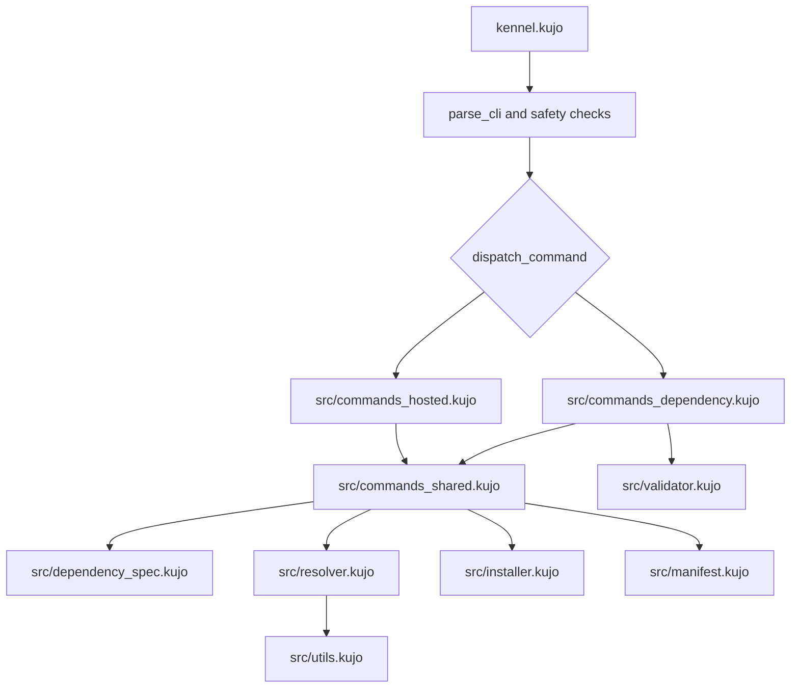
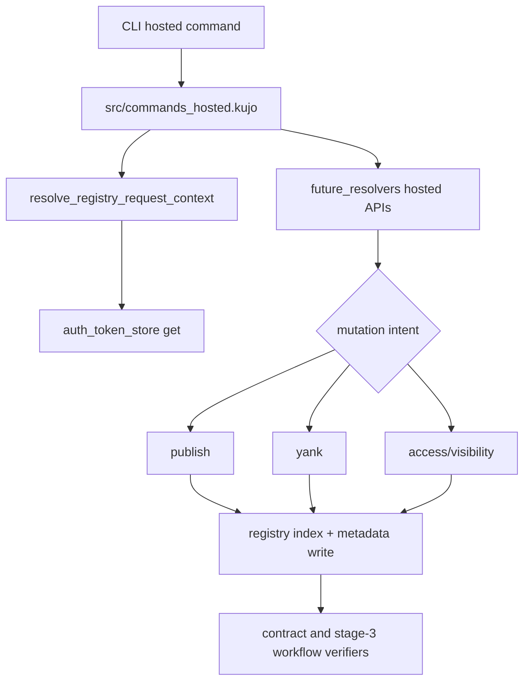
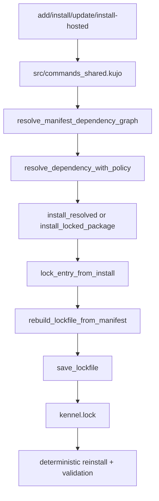

# Architecture Flow Maps

This document adds contributor-facing system flow maps aligned with current `src/` module boundaries and verification entrypoints.

## 1) Command Routing Map

Notes:

- Root-level module files (for example `commands_shared.kujo`) are compatibility shims that re-export from `src/`.
- Command-family boundaries are documented in `docs/architecture-command-boundaries.md`.

## 2) Hosted Registry Mutation Flow

Verification alignment:

- `scripts/verify-stage-3-publish-workflow.sh`
- `scripts/verify-stage-3-yank-workflow.sh`
- `scripts/verify-stage-3-ownership-workflow.sh`
- `scripts/verify-stage-3-server-permission-workflow.sh`
- `scripts/verify-stage-3-hosted-api-workflow.sh`

## 3) Lockfile Lifecycle Map

Verification alignment:

- `scripts/verify-deterministic-lockfile.sh`
- `scripts/verify-stale-lockfile.sh`
- `scripts/verify-pinned-refs.sh`
- `scripts/verify-transitive-resolution.sh`
- `scripts/verify-semver-range-resolution.sh`
- `scripts/verify-multi-registry-fallback.sh`

## Maintenance Rules

1. Keep diagrams in this file version-controlled with each routing or lifecycle change.
2. Update module references when command/shared/resolver boundaries shift.
3. Update verification alignment lists when adding or retiring gate scripts.
